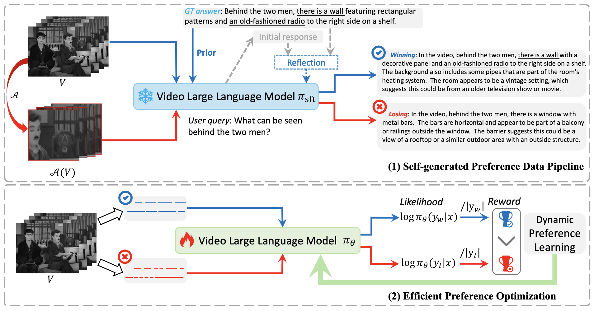
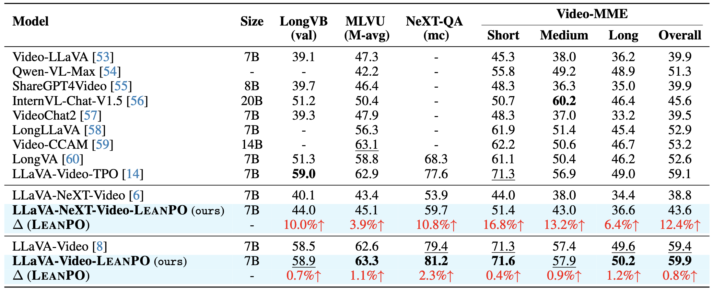
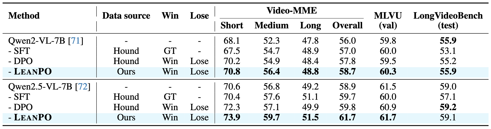

# LeanPO
The official repo of "LeanPO: Lean Preference Optimization for Likelihood Alignment in Video-LLMs"






If you found this useful, you might consider citing us.

```
@article{wang2025leanpo,
  title={LeanPO: Lean Preference Optimization for Likelihood Alignment in Video-LLMs},
  author={Wang, Xiaodong and Huang, Jinfa and Yuan, Li and Peng, Peixi},
  journal={arXiv preprint arXiv:2506.05260},
  year={2025}
}
```
